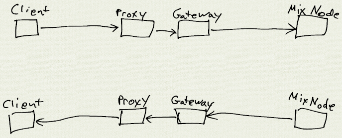

# The Elixxir cMix Design Specification

*version 0*

## Abstract

This document describes the Elixxir cMix design variations and
implementation parameterizations; that is, our mix strategy
which is at the our of our mix network, our anonymous
communications network.

## Introduction

**cMix** is a verified mix strategy which uses the cryptographic and
partial homomorphic properties of the [ElGamal encryption protocol](https://people.csail.mit.edu/alinush/6.857-spring-2015/papers/elgamal.pdf),
which is described at length in the [published cMix paper](https://eprint.iacr.org/2016/008.pdf).

## Ciphersuite

For our cMix implementation we are using the RFC 3526 specified 4096 bit ModP cyclic group for our ElGamal/cMix
encryption and homomorphic operations:

```
This prime is: 2^4096 - 2^4032 - 1 + 2^64 * { [2^3966 pi] + 240904 }

   Its hexadecimal value is:

      FFFFFFFF FFFFFFFF C90FDAA2 2168C234 C4C6628B 80DC1CD1
      29024E08 8A67CC74 020BBEA6 3B139B22 514A0879 8E3404DD
      EF9519B3 CD3A431B 302B0A6D F25F1437 4FE1356D 6D51C245
      E485B576 625E7EC6 F44C42E9 A637ED6B 0BFF5CB6 F406B7ED
      EE386BFB 5A899FA5 AE9F2411 7C4B1FE6 49286651 ECE45B3D
      C2007CB8 A163BF05 98DA4836 1C55D39A 69163FA8 FD24CF5F
      83655D23 DCA3AD96 1C62F356 208552BB 9ED52907 7096966D
      670C354E 4ABC9804 F1746C08 CA18217C 32905E46 2E36CE3B
      E39E772C 180E8603 9B2783A2 EC07A28F B5C55DF0 6F4C52C9
      DE2BCBF6 95581718 3995497C EA956AE5 15D22618 98FA0510
      15728E5A 8AAAC42D AD33170D 04507A33 A85521AB DF1CBA64
      ECFB8504 58DBEF0A 8AEA7157 5D060C7D B3970F85 A6E1E4C7
      ABF5AE8C DB0933D7 1E8C94E0 4A25619D CEE3D226 1AD2EE6B
      F12FFA06 D98A0864 D8760273 3EC86A64 521F2B18 177B200C
      BBE11757 7A615D6C 770988C0 BAD946E2 08E24FA0 74E5AB31
      43DB5BFC E0FD108E 4B82D120 A9210801 1A723C12 A787E6D7
      88719A10 BDBA5B26 99C32718 6AF4E23C 1A946834 B6150BDA
      2583E9CA 2AD44CE8 DBBBC2DB 04DE8EF9 2E8EFC14 1FBECAA6
      287C5947 4E6BC05D 99B2964F A090C3A2 233BA186 515BE7ED
      1F612970 CEE2D7AF B81BDD76 2170481C D0069127 D5B05AA9
      93B4EA98 8D8FDDC1 86FFB7DC 90A6C08F 4DF435C9 34063199
      FFFFFFFF FFFFFFFF

   The generator is: 2.
```

https://datatracker.ietf.org/doc/html/rfc3526#section-5


## Message Structure

Due to the nature of how ElGamal encryption works, the cMix payload in the paper
is the same size as the encryption keys. In the case of the Elixxir mix network
we use two payloads (defined below as payloadA and payloadB), each are 4096 bits
in size as our keys are 4096 bits.

```
                            Message Structure (not to scale)
+----------------------------------------------------------------------------------------------------+
|                                               Message                                              |
|                                          2*primeSize bits                                          |
+------------------------------------------+---------------------------------------------------------+
|                 payloadA                 |                         payloadB                        |
|              primeSize bits              |                     primeSize bits                      |
+---------+----------+---------------------+---------+-------+-----------+--------------+------------+
| grpBitA |  keyFP   |version| Contents1   | grpBitB |  MAC  | Contents2 | ephemeralRID |    SIH     |
|  1 bit  | 255 bits |1 byte |  *below*    |  1 bit  | 255 b |  *below*  |   64 bits    |  200 bits  |
+ --------+----------+---------------------+---------+-------+-----------+--------------+------------+
|                              Raw Contents                              |
|                    2*primeSize - recipientID bits                      |
+------------------------------------------------------------------------+

* size: size in bits of the data which is stored
* Contents1 size = primeSize - grpBitASize - KeyFPLen - sizeSize - 1
* Contents2 size = primeSize - grpBitBSize - MacLen - RecipientIDLen - timestampSize
* the size of the data in the two contents fields is stored within the "size" field

/////Adherence to the group/////////////////////////////////////////////////////
The first bits of keyFingerprint and MAC are enforced to be 0, thus ensuring
PayloadA and PayloadB are within the group
```

Contents1 and Contents2 are used to transmit the mix network client's
payload whereas the other sections of the message have various other
uses. Our source code [^0] represents this with a Message type in Go:

```
// Message structure stores all the data serially. Subsequent fields point to
// subsections of the serialised data.
type Message struct {
	data []byte

	// Note: These are mapped to locations in the data object
	payloadA []byte
	payloadB []byte

	keyFP        []byte
	version      []byte
	contents1    []byte
	mac          []byte
	contents2    []byte
	ephemeralRID []byte // Ephemeral reception ID
	sih          []byte // Service Identification Hash

	rawContents []byte
}
```

One byte is used to indicate the message format version because it's
conceivable we could upgrade the message format in the future. The
grpBitA and grpBitB bits are carefully set to avoid 0 vs 1 biasing
which would allow for a probabalistic tagging attack:

```
SetGroupBits takes a message and a cyclic group and randomly sets
the highest order bit in its 2 sub payloads, defaulting to 0 if 1
would put the sub-payload outside of the cyclic group.

WARNING: the behavior above results in 0 vs 1 biasing. in general, groups
used have many (100+) leading 1s, which as a result would cause
a bias of ~ 1:(1-2^-numLeadingBits). with a high number of leading bits,
this is a non issue, but if a prime is chosen with few or no leading bits,
this will cease to solve the tagging attack it is meant to fix

Tagging attack: if the dumb solution of leaving the first bits as 0 is
chosen, it is possible for an attacker to 75% of the time (when one or
both leading bits flip to 1) identity a message they made multiplied
garbage into for a tagging attack. This fix makes the leading its
random in order to thwart that attack
```

**FIXME:** Include gRPC schema, protocol semantics, network actors and description of protocol sequences.


## Protocol Phases

### Pseudo Code Cryptographic Function Glossary

The following sections are populated with pseudo code examples which
are used to explain sections of our cryptographic protocols. It is
hoped that this glossary will help you understand the pseudo code.

* |: byte concatenation

* H(x): H is a cryptographic hash function.

* HMAC(key, data): HMAC uses the given key to compute an HMAC over the given data.

* DH(my_private_key, partner_public_key):  
  Diffiehellman function used to calculate a shared secret.

* GenerateDHKeypair(): returns a DH keypair

* E(key, payload): Stream-cipher encrypt payload.

* D(key, payload): Stream-cipher decrypt payload.

* Sign(private_key, payload): Returns a cryptographic signature.

* Verify(public_key, data, signature): Returns a boolean which will be
  true if the `signature` is a signature of `data` and is valid for the
  given public key.

### Preparation Phase

Before sending a cMix message, the client needs to participate in a
preparatory protocol phase by sending key requests and processing
responses. This protocol interaction between the client and the
Gateway is done so using the xx network's wire protocol, also known as
gRPC/TLS/IP.

Each mix node is paired with one Gateway. The client is directly
connected to a Gateway which can proxy the key requests to the correct
Gateway. This Gateway in turn proxies the key request to the
destination mix node. The mix node's reply takes the reverse of this
route back to the client. This is a strict request/response protocol
with essentially only two message types as we shall soon see.



The client composes a ClientKeyRequest and then encapsulates it within
a SignedClientKeyRequest along with a signature. Within the
ClientKeyRequest itself there is a SignedRegistrationConfirmation
which also must be verified by the recipient. Here are the protobuf
definitions for ClientKeyRequest and SignedClientKeyRequest:

```
message ClientKeyRequest {
    // Salt used to generate the Client ID
    bytes Salt = 1;
    // NOTE: The following entry becomes a pointer to the blockchain that denotes
    // where to find the users public key. The node can then read the blockchain
    // and verify that the registration was done properly there.
    SignedRegistrationConfirmation ClientTransmissionConfirmation = 2;
    // the timestamp of this request,
    int64 RequestTimestamp = 3;
    // timestamp of registration, tied to ClientRegistrationConfirmation
    int64 RegistrationTimestamp = 4;
    // The public key of the client for the purposes of creating the diffie helman sesskey
    bytes ClientDHPubKey = 5;
}

message SignedClientKeyRequest {
    // Wire serialized format of the ClientKeyRequest Object (above)
    bytes ClientKeyRequest = 1;
    // RSA signature signed by the client
    messages.RSASignature ClientKeyRequestSignature = 2;
    // Target Gateway/Node - used to proxy through an alternate gateway
    bytes Target = 3;
}
```

That ClientKeyRequestSignature is in fact not merely a signature of
the serialized ClientKeyRequest because the signing algorithm is RSA
therefore the output will be the same size as the input which in this
case is the hash of the serialized ClientKeyRequest. The client's DH
public key is cryptographically linked with this signature since it's
encapsulating message is serialized, hashed and then signed. This is
common practice when using RSA signatures.

https://git.xx.network/elixxir/client/-/blob/release/network/node/register.go#L225


The response message is of type SignedKeyResponse which encapsulates
ClientKeyResponse:

```
message ClientKeyResponse {
    bytes EncryptedClientKey = 1;
    bytes EncryptedClientKeyHMAC = 2;
    bytes NodeDHPubKey = 3;
    bytes KeyID = 4; // Currently unused and empty.
    uint64 ValidUntil = 5; // Timestamp of when the key expires
}

message SignedKeyResponse {
    bytes KeyResponse = 1;
    messages.RSASignature KeyResponseSignedByGateway = 2;
    bytes ClientGatewayKey = 3; // Stripped off by node gateway
    string Error = 4;
}
```

However this message is proxied through the client's Gateway which
puts the ClientGatewayKey into a database and then removes it from the
message. Therefore the client only receives the KeyResponse and the
signature. As the field name implies, KeyResponseSignedByGateway
contains a signature computed by the Gateway.

Here we use pseudo code to show the cryptographic operations done by
the mix node after verifying that the sender is the authenticated
Gateway for this mix node:

```
func node_handle_key_request(request *SignedKeyRequest) (*SignedKeyResponse, error) {
	if !Verify(registrationPubKey,
	           H(timestamp | request.ClientKeyRequest.ClientTransmissionConfirmation.RSAPubKey),
			            request.ClientKeyRequest.ClientTransmissionConfirmation.RegistrarSignature) {
		return nil, SignatureVerificationFailure	
	}

	key = request.ClientKeyRequest.ClientTransmissionConfirmation.RSAPubKey
	data = H(request.ClientKeyRequest)
	signature = request.ClientKeyRequestSignature
	
	if !Verify(key, data, signature) {
		return nil, SignatureVerificationFailure	
	}

	encryption_key = DH(request.ClientKeyRequest.ClientDHPubKey, node_dh_priv_key)

	client_key = H(node_secret | client_ID)
	ciphertext = E(encryption_key, client_key)
	client_gateway_key = H(client_key)

	dh_pub_key, dh_priv_key = GenerateDHKeypair()
	session_key = DH(request.ClientKeyRequest.ClientDHPubKey, dh_priv_key)

	encrypted_key_hmac = HMAC(session_key, encrypted_key)

	return &SignedKeyResponse{
	        ClientGatewayKey: client_gateway_key,
			ClientKeyResponse: ClientKeyResponse{
					EncryptedClientKey:     encrypted_key,
					EncryptedClientKeyHMAC: encrypted_key_hmac,
					NodeDHPubKey:           dh_pub_key,
		},
	}, nil
}
```

The SignedKeyResponse is then proxied through the Gateway who signs
the message and removes the ClientGatewayKey, roughly in pseudo code
like this:

```
func gateway_proxy_response(response *SignedKeyResponse) *SignedKeyResponse {
	insert_into_database(response.ClientGatewayKey)
	return &SignedKeyResponse{
		KeyResponseSignedByGateway: Sign(gateway_private_key, H(response.ClientKeyResponse)),
		ClientKeyResponse: response.ClientKeyResponse,
	}
}
```

The client checks the response signature and then derives the
encryption_key via a Diffiehellman computation and then decrypts the
key:

```
func client_handle_response(response *SignedKeyResponse) {
	key = gateway_pub_key
	data = response.ClientKeyResponse
	signature = response.KeyResponseSignedByGateway
	
	if !Verify(key, data, signature) {
		return SignatureVerificationFailure
	}
	encryption_key = DH(client_dh_priv_key, response.ClientKeyResponse.NodeDHPubKey)
	key = D(encryption_key, response.ClientKeyResponse.EncryptedClientKey)

	do_stuff_with_key(key)
}
```

### Real-time phase

## Message Identification

The cryptographic primitives we are using for encryption/decryption in our
[end to end mixnet protocol](end_to_end.md)
are computationally intensive and slow. Therefore it's important that
our designs avoid trial decryption. Each cMix message has a message
fingerprint field. The fingerprint field is used in one of two ways to
find the proper decryption key.

#### Match by Message Fingerprint

Clients keep track of their fingerprints to key
mappings so that they can later match keys for decryption of received
messages.

Clients store a mapping from fingerprints to keys so that later they can
look up a key based on it's mapped association with a given message fingerprint.

Per message fingerprints are derived from three inputs:

1. session basekey
2. key ID
3. relationship fingerprint

The second half of the basekey is hashed along with the key ID and
the relationship fingerprint to derive the per message fingerprint:

	data := basekey
	data = data[len(data)/2:]
	message_fingerprint := H(data | key_id | relationship_fingerprint...)

If no fingerprint mapping was found then Trial Hashing Service Identities
are checked for a match, described below.

#### Match by Trial Hashing Service Identities

Due to the extra overhead of trial hashing, services are processed
after fingerprints. If a fingerprint match occurs on the message,
services will not be handled.

Service Identification Hash are predefined hash based tags appended
to all cMix messages which, through trial hashing, are used to
determine if a message applies to this client.

```
func ForMe(contents, hash []byte, s Service) bool {
	return H(H(s.Identifier | s.Tag) | contents) == hash
}
```

## Security Considerations

## Anonymity Considerations

* The design of the Auth protocol avoids leaking identity keys on the
  communications channel in plaintext.

* The design of the message storage and retrieval deliberately avoids
  leaking identities to non-recipients. Using deterministic message
  fingerprints to tag messages and avoid trial decryption.

## Citations

- Taher El Gamal. A public key cryptosystem and a signature scheme based on
  discrete logarithms.
  https://people.csail.mit.edu/alinush/6.857-spring-2015/papers/elgamal.pdf
  In Proceedings of CRYPTO 84 on Advances in cryptology,
  pages 10–18. Springer-Verlag New York, Inc., 1985.


[^0] https://git.xx.network/elixxir/primitives/-/blob/release/format/message.go
