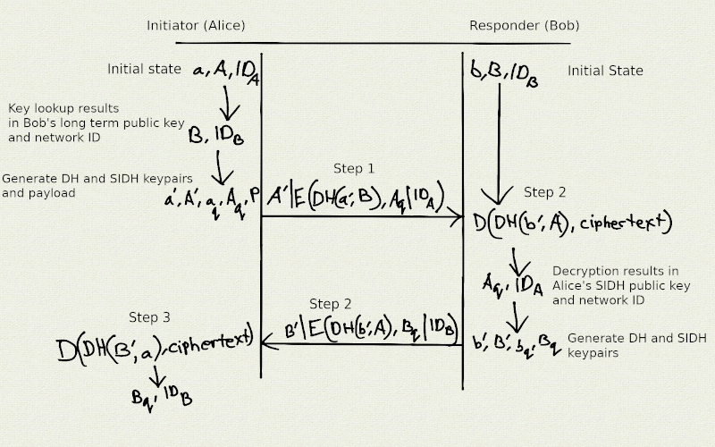
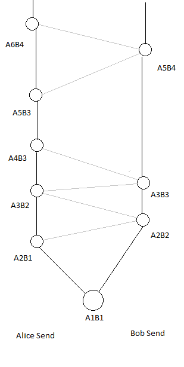
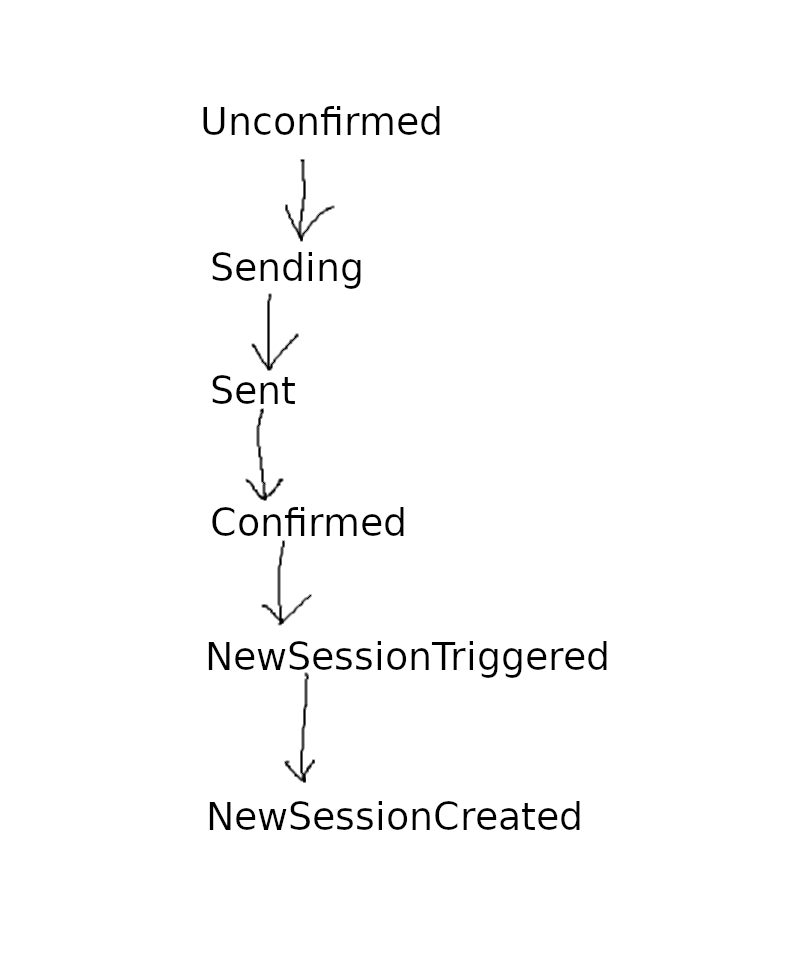

# End to End Considerations

Herein we shall present the designs of the end to end
mix network message transport along with an end to end
encryption protocol used by the xx network chat application
(known as "xx messenger", **citation needed**).

As we'll soon see, these are rather two distinct protocols.  The
encryption protocol could in theory be used with other transports but
there would be counter productive since it's optimized for use with
our cMix mix network. Likewise other types of applications besides xx
messenger could use the mix network transport protocol.

# The Elixxir End To End Transport Protocol

## Abstract

Here we describe the Elixxir mix network end to end transportation
which is an amalgam of protocols.

## Introduction

As was explained in the [architectural overview](architecture.md),
the Elixxir mix network is meant to be a general purpose mix network
that can support a wide variety of applications. The clients connect
directly to the gateways for all their network interactions. The first
application to be developed by the Elixxir development team is a chat
application that supports one on one and group chat. For the purpose
of persisting received messages from the mixnet, the gateways interact
with each other in a gossip protocol so that all the gateways receive a
copy of each message. Later clients can retrieve their messages from
any of the gateways.

The full end to end path looks like this:

**FIXME**: add an explainatory diagram

client -> gateway -> mix cascade -> gateway

This transport protocol does not require all communication parties to
be online at the same time. Messages are queued for up to two weeks in
the gateway persistent message storage.

Later on, the recipient client can retrieve their messages by
interacting with any of the gateways and querying the proper
message IDs. These message IDs are generated deterministically
by the sender and recipient clients such that there are many
message ID collisions with other clients. When clients query
for messages the gateways sends a bloom filter which the clients
use to determine which the message IDs of messages persisted.

The gateway nodes also have support for a plugin system so additional
mixnet services may be added. That is, instead of delivering a message
to a message spool, the message is instead passed on to the mixnet
service plugin which then can determine the fate of the message.

## The XX network Gateway wire protocol

* elixxir:comms/messages/messages.proto: Defines all of services and structures
  for the permissioning (registration), server, gateway, and clients in the cMix
  protocol.

The gateway service has the following gRPC service methods:


```
service Gateway {

    // RequestClientKey returns a Nonce to the user
    rpc RequestClientKey (SignedClientKeyRequest) returns (SignedKeyResponse) {
    }

    // PutMessage on the cMix Gateway
    rpc PutMessage (GatewaySlot) returns (GatewaySlotResponse) {
    }

    // PutMessage on the cMix Gateway
    rpc PutManyMessages (GatewaySlots) returns (GatewaySlotResponse) {
    }


    // Client -> Gateway unified polling
    rpc Poll (GatewayPoll) returns (stream StreamChunk) {
    }

    // Client -> Gateway historical round request
    rpc RequestHistoricalRounds(HistoricalRounds) returns (HistoricalRoundsResponse) {
    }

    // Client -> Gateway message request
    rpc RequestMessages(GetMessages) returns (GetMessagesResponse) {
    }

}
```

### Sending messages

`PutMessage` or `PutManyMessages` are used by clients to send messages. The return
values for these two methods indicates whether or not the messages were accepted
into message slots of the specified rounds. For example if all message slots are filled
then the return value indicates the message was not accepted and the client must resend
to a different round.

### Receiving messages

A bloom filter is returned as part of the stream and is used by the
client to determine if a message ID has a message delivered or
not. The client may call `RequestMessages` with a set of message IDs
that have been initially confirmed with the bloom filter.

## Message ID Collisions

The message ID space is tuned intentionally to increase the
probability of message ID collisions between clients. These collisions
help protect against intersection attacks. Clients will retrieve
multiple messages and in that sense each message ID represents a
bucket of messages destined for multiple clients.

Clients check the hash at the end of the message, the identity
fingerprint.  If it matches their own identity fingerprint then the
message can be processed with the cryptographic protocol described
below.


# The Elixxir Chat End To End Cryptographic Protocol

## Abstract

Here we discuss some design details of the end to end cryptographic
protocols of the xx network chat application known as xx
messenger.

## Introduction

In addition to message confidentiality and authenticity we have the
additional requirement of bitwise indistinguishability. Meaning that
we don't want our end to end message ciphertexts leaking any bits of
information that helps an adversary distinguish some kind of metadata.

Unlike common encrypted chat applications, here we cannot afford to
exchange new keys with every message since the DH and SIDH keys take
up most of the available payload in a cMix message. Therefore keys are
exchanged less frequently than every message.

## Cryptographic primitives

* XChaCha20: Length is 256 bits. Used for encrypting message payloads.
* Blake2b: Length is 256 bits. Used as part of key generation, key
  expansion, identity generation, and identification codes. Used to
  combine Diffie–Helman and SIDH keys after key integration.
* HMAC-SHA256: Length is 256 bits. Message HMACs.
* [Diffie–Helmen](https://en.wikipedia.org/wiki/Diffie%E2%80%93Hellman_key_exchange): Length is 3072 bits. Discrete log-based component of key negotiation.
* [SIDH](https://sike.org/files/SIDH-spec.pdf): Length of public key is 3024 bits. Quantum resistant component of key negotiation.

## Auth Request Response Protocol

The Auth Request Response Protocol is similar a two way handshake
with preshared keys whereas in this case only the sender has the
longterm identity key and network ID of the other party.
It should also be noted that the exchange is fully authenticated and
is interactive; it requires explicit authorization of both parties.
This protocol is used by xx messenger and is a prerequisite to it's
establishing a secure communications channel between two clients.
It can be initiated via client exchange of QR codes or by means of the
[user discovery](https://xxnetwork.wiki/User_Discovery) protocol.
Either way the exchange of both party's network IDs is a prerequisite.

An important property of this protocol is that it does not leak long
term identity keys or network IDs. If it did leak such data then there
would be no point in using a mix network to hide the identities of the
communicating parties.

### Pseudo Code Cryptographic Function Glossary

The following sections are populated with pseudo code examples which
are used to explain sections of our cryptographic protocols. It is
hoped that this glossary will help you understand the pseudo code.

* |: byte concatenation

* H(x): H is a cryptographic hash function.

* DH(my_private_key, partner_public_key):  
  Diffiehellman function used to calculate a shared secret.

* ownership_proof(my_private_key, partner_public_key):  
  The ownership proof is simply the hash of a Diffiehellman shared secret
  and the ownership proof vector, defined as:  

  H(DH(my_private_key, partner_public_key) | "ownershipVector")  

  Which is to say that "ownershipVector" vector is also hashed along
  with the Diffiehellman output.

* E(key, payload): Stream-cipher encrypt payload.

* D(key, payload): Stream-cipher decrypt payload.

* Encrypt(key, payload): Encrypt and then MAC:  
  MAC(key, E(key, payload))  

* Decrypt(key, payload): MAC then Decrypt:  
  if MAC(key, payload) { // If MAC is valid...  
	  D(key, payload)  
  }  

### High level Auth protocol description



**Note**: Since the SIDH keypairs are ephemeral encrypting the
public SIDH keys isn't necessary but is done so at this time
because it's an artifact of our implementation.


This is a two party protocol with a couple of assumptions:

1. Each party has a long term Diffiehellman key pair and a network ID.
2. The sender learns their partner's long term Diffiehellman public
   key and network ID by means of a QR code or by using the user
   discovery database.

Before anything is sent on the network, each party then generates the following:

1. Ephemeral Diffiehellman key pair
2. Ephemeral SIDH key pair

Let's work an example with Alice and Bob where Alice is the initiator
who sends the Auth Request Message and Bob is the responder who
replies with the Auth Response Message. Through the use of the xx
network's User Discovery protocol Alice first learns Bob's long term
DH public key and Network ID. Once Bob decrypts the Auth Request he
receives from Alice, he learns Alice's network ID and can use this to
retrieve Alice's long term DH public key and confirm the ownership proof
she sends.

Alice's initial state contains:

* alice_network_id
* alice_longterm_dh_private_key
* alice_longterm_dh_public_key
* bob_network_id
* bob_longterm_dh_public_key

Bob's initial state contains:

* bob_network_id
* bob_longterm_dh_private_key
* bob_longterm_dh_public_key
* alice_network_id
* alice_longterm_dh_public_key

Protocol steps:

1. Alice generates some short term keys and then computes the Auth Request
   Message, denoted as alice_auth_request, and sends it to Bob:

	Keys generated:
	* short-term DH key pair:
		* alice_ephemeral_dh_private_key
		* alice_ephemeral_dh_public_key
	* short-term SIDH key pair:
		* alice_ephemeral_sidh_private_key
		* alice_ephemeral_sidh_public_key
	* payload:
		* alice_payload

```
	symmetric_key = DH(alice_ephemeral_dh_private_key, bob_longterm_dh_public_key)
	alice_ownership_proof = ownership_proof(alice_longterm_dh_private_key, bob_longterm_dh_public_key)
	alice_auth_request = alice_ephemeral_dh_public_key |
	   Encrypt(symmetric_key, alice_ephemeral_sidh_public_key | alice_payload | alice_ownership_proof | alice_network_id)
```

2. Bob receives alice_auth_request, decrypts it, generates some short term keys
   and computes a reply denoted as bob_auth_response, and sends it to Alice:

```
	alice_ephemeral_sidh_public_key, alice_payload, alice_ownership_proof, alice_network_id
	   = Decrypt(DH(bob_longterm_dh_private_key, alice_ephemeral_dh_public_key), alice_auth_request)
```

Keys generated:

* short-term DH key pair:
  * bob_ephemeral_dh_private_key
  * bob_ephemeral_dh_public_key
* short-term SIDH key pair:
  * bob_ephemeral_sidh_private_key
  * bob_ephemeral_sidh_public_key

```
	symmetric_key = DH(bob_ephemeral_dh_private_key, alice_longterm_dh_public_key)
	bob_ownership_proof = ownership_proof(bob_longterm_dh_private_key, alice_longterm_dh_public_key)
	bob_auth_response = bob_ephemeral_dh_public_key | Encrypt(symmetric_key, bob_ephemeral_sidh_public_key | bob_ownership_proof | bob_network_id)
```

3. Alice receives bob_auth_response and decrypts it:

```
	symmetric_key = DH(alice_longterm_dh_private_key, bob_ephemeral_dh_public_key)
	bob_ephemeral_sidh_public_key, bob_ownership_proof, bob_network_id = Decrypt(symmetric_key, bob_auth_response)
```

Protocol Conclusion State:

The conclusion to this protocol is that Alice and Bob's states were
updated with the following information:

Alice's state:

* bob_ephemeral_dh_public_key
* bob_ephemeral_sidh_public_key
* bob_ownership_proof
* bob_network_id

Bob's state:

* alice_ephemeral_dh_public_key
* alice_ephemeral_sidh_public_key
* alice_payload
* alice_ownership_proof
* alice_network_id


### Common message structures

The Auth Request and Response protocol messages are both composed from
the following common nested structures:

* cMix Message: This message is the outer most protocol message and is
  responsible for routing the message through the network in such a manner
  as to leak very little metadata. See our [cMix section](cmix.md) for
  a detailed discussion. Suffice it to say here we note that this message
  encapsulates an encrypted Payload field.

* Base Format Message: The Base Format Message encapsulates two fields:

   * Payload
   * DH_public_key

* Encrypted Formate Message: The Encrypted Format Message encapsulated
these encrypted fields:

   * Payload
   * ownership proof
   * SIDH public key

### Auth Request Message format

The Auth Request Message is composed of a series of nested structs.
The inner most payload is known as the Request Format Message and
it encapsulated two fields:

   * ID
   * Message Payload

This nested series of structs can be summarized programmatically with
Golang inspired pseudocode, like so:

    c := &CMixMessage {
        ... // Various cMix fields
        
        Payload: BaseFormat {
        
            DHPublicKey: []byte{...},
            
            Payload: EncryptedFormat {
            
                OwnershipProof: []byte{...},
                
                SIDHPublicKey: []byte{...},
                
                Payload: RequestFormat {
                
                    ID: []byte{...},
                    
                    MessagePayload: []byte{...},
                }
            }
        }
    }


### Auth Response message format

The Auth Response message is encapsulated in a series of nested
structs. The inner most payload is known as Encrypted Format Message
who's payload field is zero size. This Encrypted Format is encrypted
and MAC'ed. The ciphertext and MAC output is then encapsulated by the
Base Format which in turn is encapsulated by the cMix message.

This nested series of structs can be summarized programmatically with
Golang inspired pseudocode, like so:

    c := &CMixMessage {
        ... // Various cMix fields
        
        Payload: BaseFormat {
        
            DHPublicKey: []byte{...},
            
            Payload: EncryptedFormat {
            
                OwnershipProof: []byte{...},
                
                SIDHPublicKey: []byte{...},
                
                Payload: []byte{}, // Zero length byte slice.
            }
        }
    }


## End to End Session Handling

### Sessions in End to End Encryption

A session is a single state within the ratchet. Sessions are discussed
in more detail in the key rotation section. However here we'll
briefly mention that sessions can rotate quickly if both parties are
sending many frequent messages and sessions can last a while if only
one party is sending messages. This is an intentional design element
that is a consequence of a more fundamental and design constraint:
"We don't use elliptic curve cryptography."

Rekeying requires most of the payload of one cMix message and therefore
our end to end protocol minimizes the number of rekeys in comparison
to most double ratchet key protocols which rekey with every message sent.

### Per session key derivation

Communicating clients form a session and the prerequisite for that is
the exchange of keys handled by the Auth protocol described in the
previous chapter. Both communicating clients exchange their DH public
keys and their SIDH public keys. Each session derives what is known
in our code base as a "baseKey" which is deterministically derived
from the DH and SIDH shared secrets.

	basekey := GenerateInGroup(HKDF(H(DH_shared_secret | SIDH_shared_secret)))

The two shared secrets are hashed together using Blake2b and then
expanded using HKDF-Blake2b. However currently the HKDF expansion
output is feed into an algorithm for selecting an element of the
cyclic group, a function called ``GenerateInGroup``. The "baseKey" is
an element of the cyclic group but this isn't currently a requirement
and we have plans to change this in the future so that basekey will be
a 32 byte value instead.

### Per Message Key Derivation and per Message Encryption/Decryption

Each key in a session is deterministically generated when it's needed from
three input arguments:

1. session's baseKey
2. relationship fingerprint
3. key ID

First a relationship fingerprint is computed. For a given pair of
communication partners there are two relationship fingerprints. If for
example Alice and Bob are communicating then Alice computes a
relationship fingerprint for when she receives a message from Bob and
another one for when she Sends a message to Bob.

The relationship fingerprint is essentially a deterministic hash of
both party's public DH keys and their network IDs. It looks something
like this in pseuodo code:

	func MakeRelationshipFingerprint(pubkeyA, pubkeyB *cyclic.Int, sender,
		receiver *id.ID) []byte {
		if pubKeyA > pubKeyB {
			return H(pubKeyA | pubKeyB | sender | receiver)
		} elsif pubkeyA < pubKeyB {
			return H(pubKeyB | pubKeyA | sender | receiver)
		} else {
			// error if keys are equal
		}
	}

As for the key ID, it's essentially a unique integer for each key in a
given session. We calculate the key by hashing the first half of the
baseKey with the keyID and the relationship fingerprint:

    data := basekey
	data = data[:len(data)/2]
	key := H(data | key_id | relationship_fingerprint...)

The message Encrypt and Decrypt functions compute the symmetric key
as described above. The Encrypt function also sets the cMix message
fingerprint and payload MAC. Whereas the Decrypt function verifies
the payload ciphertext MAC before decrypting.

### Message Tagging and Identification

Each cMix message is tagged with a message fingerprint which is
used to avoid any trial decryption. The recipient client will be
able to look up a key based on it's mapped association with a
given message fingerprint.

Per message fingerprints are derived from three inputs:

1. session basekey
2. key ID
3. relationship fingerprint

The second half of the basekey is hashed along with the key ID and
the relationship fingerprint to derive the per message fingerprint:

	data := basekey
	data = data[len(data)/2:]
	message_fingerprint := H(data | key_id | relationship_fingerprint...)

### Privacy Design Considerations

1. Don't leak identities to non-recipients. Using deterministic
   message fingerprints to tag messages and avoid trial decryption.
2. Minimize ratchet rekeying because these rekeying operations leak
   metadata since they require almost an entire cMix packet payload.

### Message Encryption and Decryption

As noted in our glossary entries the encrypt/decrypt
makes use of a stream cipher and MAC:

* Encrypt(key, payload): Encrypt and then MAC:  
  MAC(key, E(key, payload))  

* Decrypt(key, payload): MAC then Decrypt:  
  if MAC(key, payload) { // If MAC is valid...  
	  D(key, payload)  
  }  

In the future we'd like to replace this with an AEAD. The Encrypt
also sets the message fingerprint field of the cMix message. Please
see our [cMix design document](cmix.md) for more detailed information
about the cMix message format.

### Avoiding Trial Decryption

The cryptographic primitives we are using for encryption/decryption
are computationally intensive and slow. Therefore it's important that
our designs avoid trial decryption.

#### Match by message fingerprint

As mentioned in the previous section "Message Tagging and
Identification", clients keep track of their fingerprints to key
mappings so that they can later match keys for decryption of received
messages.

#### Match by Trial Hashing Service Identities

Due to the extra overhead of trial hashing, services are processed
after fingerprints. If a fingerprint match occurs on the message,
services will not be handled.

Service Identification Hash are predefined hash based tags appended
to all cMix messages which, through trial hashing, are used to
determine if a message applies to this client.

```
func ForMe(contents, hash []byte, s Service) bool {
	return H(H(s.Identifier | s.Tag) | contents) == hash
}
```

### End to End Cryptographic Session

#### Introduction to Rekeying

Clients MUST periodically rekey. In the xx network protocol parlance
rekeying means to create a new session created with a new basekey. Two
new ephemeral session keypairs are computed; a new ephemeral DH
keypair and a new SIDH ephemeral keypair. The public keys of these
keypairs are sent to the other party and a new shared secrets are
computed and used in the creation of a new basekey.

Although a new session is created, the old session will still be used
until the keys are exhausted.

Here are our protobuf definitions for RekeyTrigger and RekeyConfirm messages:

```
message RekeyTrigger {
    // PublicKey used in the rekey
    bytes publicKey = 1;
    // SIDHPublicKey used in the rekey
    bytes sidhPublicKey = 2;
    // ID of the session used to create this session
    bytes sessionID = 3;
}

message RekeyConfirm {
    // ID of the session created
    bytes sessionID = 1;
}
```

Each party computes a basekey for the new session:

```
basekey := GenerateInGroup(HKDF(H(DH_shared_secret | SIDH_shared_secret)))
```

#### Scheduling

At the bottom of the following diagram, Alice and Bob each start out
using the same shared secret A1B1. For Alice this A1B1 shared secret
is computed like so:

```
basekey := GenerateInGroup(HKDF(H(DH(A1private, B1public) | SIDH(A1qprivate, B1qpublic))))
```

Whereas Bob would compute it like so:

```
basekey := GenerateInGroup(HKDF(H(DH(B1private, A1public) | SIDH(B1qprivate, A1qpublic))))
```



Between A1B1 and A2B1 there have been many messages sent by
Alice. Alice hits her rekey threshold first so she sends a rekey
messages to Bob, receives the rekey reply and then starts using a new
shared secret marked in the diagram as A2B1. This labelling in the
diagram means that Alice has generated a new session keypair known as
A2 and she used it to compute a new session shared secret using Bob's
B1 public key.

Alice and Bob will each initiate rekeying at different times because
they will each select random thresholds for their sessions and will
likely consume the session keys at differing rates. A little while
later Bob's rekey (A2B2) happens. Alice and Bob will each send
messages until they hit the randomly select threshold for that session and then
they will attempt a rekey using their communication partner's latest
public key.

#### Rekey Finite State Machine



Rekey finite state machine states:
* Unconfirmed: Sessions start their life in the unconfirmed state.
* Sending: Sending means that the rekey is being sent.
* Sent: Sent means that the rekey was sent.
* Confirmed: Confirmed means that rekey that was sent received a reply.
* NewSessionTriggered: New rekeying session being created.
* NewSessionCreated: Each rekey session ends with this NewSessionCreated state
  which means that the new rekey session was created.

Note that only three states are saved to disk upon state transition, thus
acting as transaction checkpoints:

* Unconfirmed
* Confirmed
* NewSessionCreated

Therefore if the client crashes when in state NewSessionTriggered,
then upon restart the client would continue from the Confirmed
state. Likewise if crashed in the Sending or Sent state, the client
would start in the Unconfirmed state.

Likewise, all the state changes occuring between the checkpoints
are idempotent or result in benign state changes. If for example
Alice's rekey state transitions into the NetSessionTriggered state
and Alice manages to send a rekey message to Bob before crashing.
Bob receives the rekey. If Bob's current session hits it's threshold
then Bob will use the new key he just got from Alice. Alice's client
recently crash and upon restart it will not attempt to use the new
session key it just sent to Bob because the rekey state that's loaded
from disk will be in the Confirmed state.

Alice will again send a new rekey message to Bob when she transitions
into the NewSessionTriggered. However when Alice receives messages
from Bob she must decrypt them using the session key she generated
before her client crashed. Alice has this old session key saved to
disk. Writing keys to disk is done separately from the rekey
state. Alice can delete this old key only after Bob stops using it.

#### Edge cases

There are many edge cases. One of them is: If a rekey that was Sent is
never Confirmed then a rekey will again be sent in the future at some
randomly selected time.

#### Privacy Considerations

Rekeys are sent sparringly because they take up the majority of the
cMix payload capacity. Rekey messages cause metadata to be leaked
because the receiving client always responds in a timely
manner. Whereas in the future we should have rekey responses sent
after some random time delay.
