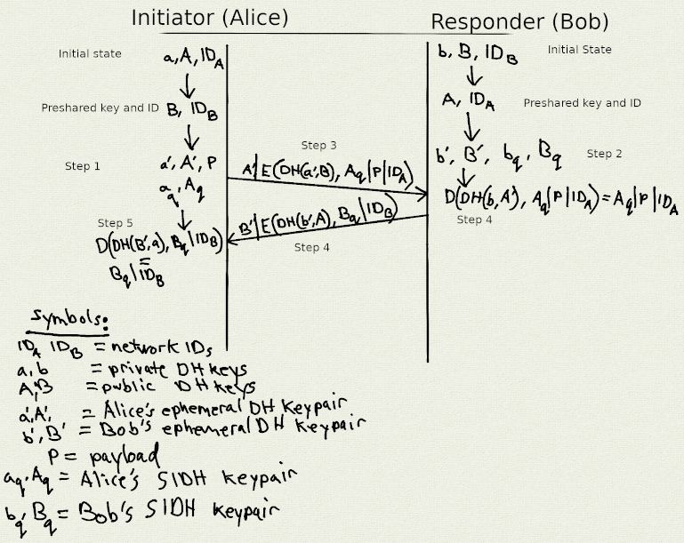

# End to End Considerations

Herein we shall present the designs of the end to end
mix network message transport along with an end to end
encryption protocol used by the xx network chat application
(known as "xx messenger", **citation needed**).

As we'll soon see, these are rather two distinct protocols.  The
encryption protocol could in theory be used with other transports but
there would be counter productive since it's optimized for use with
our cMix mix network. Likewise other types of applications besides xx
messenger could use the mix network transport protocol.

# The Elixxir End To End Transport Protocol

## Abstract

Here we describe the Elixxir mix network end to end transportation
which is an kind of amalgam of protocols.

## Introduction

As was explained in the [architectural overview](architecture.md),
the Elixxir mix network is meant to be a general purpose mix network
that can support a wide variety of applications. The clients connect
directly to the gateways for all their network interactions. The first
application to be developed by the Elixxir development team is a chat
application that supports one on one and group chat. For the purpose
of persisting received messages from the mixnet, the gateways interact
with each other in a gossip protocol so that all the gateways receive a
copy of each message. Later clients can retrieve their messages from
any of the gateways.

The full end to end path looks like this:

**FIXME**: add an explainatory diagram

client -> gateway -> mix cascade -> gateway

This transport protocol does not require all communication parties to
be online at the same time. Messages are queued for up to two weeks in
the gateway persistent message storage.

Later on, the recipient client can retrieve their messages by
interacting with any of the gateways and querying the proper
message IDs. These message IDs are generated deterministically
by the sender and recipient clients such that there are many
message ID collisions with other clients. When clients query
for messages the gateways sends a bloom filter which the clients
use to determine which the message IDs of messages persisted.

The gateway nodes also have support for a plugin system so additional
mixnet services may be added. That is, instead of delivering a message
to a message spool, the message is instead passed on to the mixnet
service plugin which then can determine the fate of the message.

## The XX network Gateway wire protocol

* elixxir:comms/messages/messages.proto: Defines all of services and structures
  for the permissioning (registration), server, gateway, and clients in the cMix
  protocol.

The gateway service has the following gRPC service methods:


```
service Gateway {

    // RequestClientKey returns a Nonce to the user
    rpc RequestClientKey (SignedClientKeyRequest) returns (SignedKeyResponse) {
    }

    // PutMessage on the cMix Gateway
    rpc PutMessage (GatewaySlot) returns (GatewaySlotResponse) {
    }

    // PutMessage on the cMix Gateway
    rpc PutManyMessages (GatewaySlots) returns (GatewaySlotResponse) {
    }


    // Client -> Gateway unified polling
    rpc Poll (GatewayPoll) returns (stream StreamChunk) {
    }

    // Client -> Gateway historical round request
    rpc RequestHistoricalRounds(HistoricalRounds) returns (HistoricalRoundsResponse) {
    }

    // Client -> Gateway message request
    rpc RequestMessages(GetMessages) returns (GetMessagesResponse) {
    }

}
```

### Sending messages

`PutMessage` or `PutManyMessages` are used by clients to send messages. The return
values for these two methods indicates whether or not the messages were accepted
into message slots of the specified rounds. For example if all message slots are filled
then the return value indicates the message was not accepted and the client must resend
to a different round.

### Receiving messages

A bloom filter is returned as part of the stream and is used by the
client to determine if a message ID has a message delivered or
not. The client may call `RequestMessages` with a set of message IDs
that have been initially confirmed with the bloom filter.

## Message ID Collisions

The message ID space is tuned intentionally to increase the
probability of message ID collisions between clients. These collisions
help protect against intersection attacks. Clients will retrieve
multiple messages and in that sense each message ID represents a
bucket of messages destined for multiple clients.

Clients check the hash at the end of the message, the identity
fingerprint.  If it matches their own identity fingerprint then the
message can be processed with the cryptographic protocol described
below.


# The Elixxir Chat End To End Cryptographic Protocol

## Abstract

Here we discuss some design details of the end to end cryptographic
protocols of the xx network chat application known as xx
messenger.

## Introduction

In addition to message confidentiality and authenticity we have the
additional requirement of bitwise indistinguishability. Meaning that
we don't want our end to end message ciphertexts leaking any bits of
information that helps an adversary distinguish some kind of metadata.

Unlike common encrypted chat applications, here we cannot afford to
exchange new keys with every message since the DH and SIDH keys take
up most of the available payload in a cMix message. Therefore keys are
exchanged less frequently than every message.

## Cryptographic primitives

* XChaCha20: Length is 256 bits. Used for encrypting message payloads.
* Blake2b: Length is 256 bits. Used as part of key generation, key
  expansion, identity generation, and identification codes. Used to
  combine Diffie–Helman and SIDH keys after key integration.
* HMAC-SHA256: Length is 256 bits. Message HMACs.
* [Diffie–Helmen](https://en.wikipedia.org/wiki/Diffie%E2%80%93Hellman_key_exchange): Length is 3072 bits. Discrete log-based component of key negotiation.
* [SIDH](https://sike.org/files/SIDH-spec.pdf): Length of public key is 3024 bits. Quantum resistant component of key negotiation.

## Auth Request Response Protocol

The Auth Request Response Protocol is similar a two way handshake
with preshared keys whereas in this case only the sender has the
longterm identity key and network ID of the other party.
It should also be noted that the exchange is fully authenticated and
is interactive; it requires explicit authorization of both parties.
This protocol is used by xx messenger and is a prerequisite to it's
establishing a secure communications channel between two clients.
It can be initiated via client exchange of QR codes or by means of the
[user discovery](https://xxnetwork.wiki/User_Discovery) protocol.
Either way the exchange of both party's network IDs is a prerequisite.

An important property of this protocol is that it does not leak long term
identity keys. If it did leak such keys then there would be no point in using
a mix network to hide the identities of the communicating parties.

### Cryptographic Function Glossary

* |: byte concatenation

* H(x): H is a cryptographic hash function.

* DH(my_private_key, partner_public_key):
  Diffiehellman function used to calculate a shared secret.

* ownership_proof(my_private_key, partner_public_key):
  The ownership proof is simply the hash of a Diffiehellman shared secret
  and the ownership proof vector, defined as:

  H(DH(my_private_key, partner_public_key) | "ownershipVector")

  Which is to say that "ownershipVector" vector is also hashed along
  with the Diffiehellman output.

* E(key, payload): Stream-cipher encrypt payload.

* D(key, payload): Stream-cipher decrypt payload.

* Encrypt(key, payload): Encrypt and then MAC:
  MAC(key, E(key, payload))

* Decrypt(key, payload): MAC then Decrypt:
  if MAC(key, payload) { // If MAC is valid...
	  D(key, payload)
  }

### High level Auth protocol description



This is a two party protocol with a couple of assumptions:

1. Each party has a long term Diffiehellman key pair and a network ID.
2. The sender learns their partner's long term Diffiehellman public
   key and network ID by means of a QR code or by using the user
   discovery database.

Before anything is sent on the network, each party then generates the following:

1. Ephemeral Diffiehellman key pair
2. Ephemeral SIDH key pair

Let's work an example with Alice and Bob where Alice is the initiator
who sends the Auth Request Message and Bob is the responder who
replies with the Auth Response Message. Through the use of the xx
network's User Discovery protocol Alice first learns Bob's long term
DH public key and Network ID. Once Bob decrypts the Auth Request he
receives from Alice, he learns Alice's network ID and can use this to
retrieve Alice's long term DH public key and confirm the ownership proof
she sends.

Alice's initial state contains:

* alice_network_id
* alice_longterm_dh_private_key
* alice_longterm_dh_public_key
* bob_network_id
* bob_longterm_dh_public_key

Bob's initial state contains:

* bob_network_id
* bob_longterm_dh_private_key
* bob_longterm_dh_public_key
* alice_network_id
* alice_longterm_dh_public_key

Protocol steps:

1. Alice generates some short term keys and then computes the Auth Request
   Message, denoted as alice_auth_request, and sends it to Bob:

	Keys generated:
	* short-term DH key pair:
		* alice_ephemeral_dh_private_key
		* alice_ephemeral_dh_public_key
	* short-term SIDH key pair:
		* alice_ephemeral_sidh_private_key
		* alice_ephemeral_sidh_public_key
	* payload:
		* alice_payload

	symmetric_key = DH(alice_ephemeral_dh_private_key, bob_longterm_dh_public_key)  
	alice_ownership_proof = ownership_proof(alice_longterm_dh_private_key, bob_longterm_dh_public_key)  
	alice_auth_request = alice_ephemeral_dh_public_key |
	   Encrypt(symmetric_key, alice_ephemeral_sidh_public_key | alice_payload | alice_ownership_proof | alice_network_id)  

2. Bob receives alice_auth_request, decrypts it, generates some short term keys
   and computes a reply denoted as bob_auth_response, and sends it to Alice:

	alice_ephemeral_sidh_public_key, alice_payload, alice_ownership_proof, alice_network_id
	   = Decrypt(DH(bob_longterm_dh_private_key, alice_ephemeral_dh_public_key), alice_auth_request)  

	Keys generated:
	* short-term DH key pair:
		* bob_ephemeral_dh_private_key
		* bob_ephemeral_dh_public_key
	* short-term SIDH key pair:
		* bob_ephemeral_sidh_private_key
		* bob_ephemeral_sidh_public_key

	symmetric_key = DH(bob_ephemeral_dh_private_key, alice_longterm_dh_public_key)  
	bob_ownership_proof = ownership_proof(bob_longterm_dh_private_key, alice_longterm_dh_public_key)  
	bob_auth_response = bob_ephemeral_dh_public_key | Encrypt(symmetric_key, bob_ephemeral_sidh_public_key | bob_ownership_proof | bob_network_id)  

3. Alice receives bob_auth_response and decrypts it:

	symmetric_key = DH(alice_longterm_dh_private_key, bob_ephemeral_dh_public_key)  
	bob_ephemeral_sidh_public_key, bob_ownership_proof, bob_network_id = Decrypt(symmetric_key, bob_auth_response)  

Protocol Conclusion State:

The conclusion to this protocol is that Alice and Bob's states were
updated with the following information:

Alice's state:

* bob_ephemeral_dh_public_key
* bob_ephemeral_sidh_public_key
* bob_ownership_proof
* bob_network_id

Bob's state:

* alice_ephemeral_dh_public_key
* alice_ephemeral_sidh_public_key
* alice_payload
* alice_ownership_proof
* alice_network_id


### Common message structures

The Auth Request and Response protocol messages are both composed from
the following common nested structures:

* cMix Message: This message is the outer most protocol message and is
  responsible for routing the message through the network in such a manner
  as to leak very little metadata. See our [cMix section](cmix.md) for
  a detailed discussion. Suffice it to say here we note that this message
  encapsulates an encrypted Payload field.

* Base Format Message: The Base Format Message encapsulates two fields:

   * Payload
   * DH_public_key

* Encrypted Formate Message: The Encrypted Format Message encapsulated
these encrypted fields:

   * Payload
   * ownership proof
   * SIDH public key

### Auth Request Message format

The Auth Request Message is composed of a series of nested structs.
The inner most payload is known as the Request Format Message and
it encapsulated two fields:

   * ID
   * Message Payload

This nested series of structs can be summarized programmatically with
Golang inspired pseudocode, like so:

    c := &CMixMessage {
        ... // Various cMix fields
        
        Payload: BaseFormat {
        
            DHPublicKey: []byte{...},
            
            Payload: EncryptedFormat {
            
                OwnershipProof: []byte{...},
                
                SIDHPublicKey: []byte{...},
                
                Payload: RequestFormat {
                
                    ID: []byte{...},
                    
                    MessagePayload: []byte{...},
                }
            }
        }
    }


### Auth Response message format

The Auth Response message is encapsulated in a series of nested
structs. The inner most payload is known as Encrypted Format Message
who's payload field is zero size. This Encrypted Format is encrypted
and MAC'ed. The ciphertext and MAC output is then encapsulated by the
Base Format which in turn is encapsulated by the cMix message.

This nested series of structs can be summarized programmatically with
Golang inspired pseudocode, like so:

    c := &CMixMessage {
        ... // Various cMix fields
        
        Payload: BaseFormat {
        
            DHPublicKey: []byte{...},
            
            Payload: EncryptedFormat {
            
                OwnershipProof: []byte{...},
                
                SIDHPublicKey: []byte{...},
                
                Payload: []byte{}, // Zero length byte slice.
            }
        }
    }
