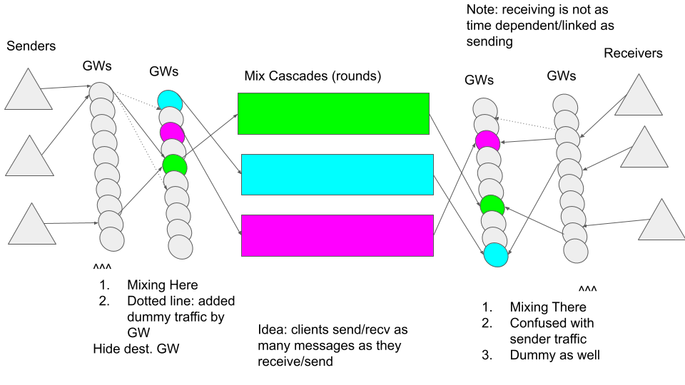

## XX Network Gateway Mixing

Ben Wenger  
Rick Carback  
David Stainton  

## Abstract

Here we discuss how to thwart traffic analysis such that
client interactions with Gateways are hidden. We not only
hide the type of interaction but also the destination
Gateway the interaction is taking place with.

### Pseudo Code Cryptographic Function Glossary

The following sections are populated with pseudo code examples which
are used to explain sections of our cryptographic protocols. It is
hoped that this glossary will help you understand the pseudo code.

* |: byte concatenation

* H(x): H is a cryptographic hash function.

* HMAC(key, data): HMAC uses the given key to compute an HMAC over the given data.

* DH(my_private_key, partner_public_key):  
  Diffiehellman function used to calculate a shared secret.

* AEAD_ENCRYPT(key, nonce, payload):  
  Given a key and a nonce encrypt the payload with an AEAD cipher.

* AEAD_DECRYPT(key, nonce, ciphertext):  
  Given a key and a nonce decrypt the ciphertext with an AEAD cipher.

## Introduction

By hiding the Gateway that a client is interacting with, we increase
mix cascade entropy. Mix cascade entropy should then grow linearly
with the number of mix cascades. Adversaries will be uncertain which
mix cascade is being used to send a message and a correct guess as to
which mix cascade is met with the uncertainty of the output message
slot.



The client `Senders` on the left hand side of the diagram send their
payloads to a randomly selected Gateway which performs the mixing and
then proxies each payload to their destination Gateway. The inner
payload is encrypted by the sending client and decrypted by the
destination Gateway. The mixing Gateway does not perform any
cryptographic transformations, similar to a `funnel node` as described
in [Divide and Funnel: a Scaling Technique for
Mix-Networks](https://eprint.iacr.org/2021/1685.pdf).  However in our
case a cryptographic authentication operation is performed twice; once
by the mixing Gateway and another time by the destination Gateway.

The mixing Gateways provide bitwise unlinkability between input and
output messages by relying on our mixnet link layer protocol, in this case
TLS. Of course, ALL Gateway protocol messages must be padded to be
equal length. Likewise all Gateway protocol messages must have similar
looking traffic patterns or some small number of such traffic patterns
should be mimicked by the decoy traffic.

In particular we want to look at the ratio of sent messages to
received messages. Are they always equal or are one-way messages
allowed? Are the delays between request and response always the same?
Do we have appropriate decoy traffic to mimick each of the observable
traffic patterns? Ideally all the traffic looks the same and only one
type of decoy traffic is used. This is ideal because the client design
is simple. Multiple traffic types can easily make the client design
much more complicated.

In addition to the aforementioned client decoy traffic, the Gateways
send gossip messages to one another. If these messages are
padded to the same size as messages originating from clients then it
increases mix entropy on the Gateway mixing just like decoy traffic
increases mix entropy.

## Traffic Padding

All gRPC messages which the client sends to the destination Gateway
will be serialized, encrypted and encapsulated by the
`AuthenticatedPaddedMessage` message type:

```
message AuthenticatedPaddedMessage {
	bytes IngressAuth = 1;
	bytes ClientID = 2;
	bytes Timestamp = 3;
	bytes destGW = 4
	bytes Payload = 5;
	bytes Padding = 6;
}
```

The `Payload` field shall contain the serialized gRPC message; and given
the length of this message a padding length must be calculated. We must
also take care to pad the Gateway gossip messages to the same length
as the `AuthenticatedPaddedMessage` messages.

## Ingress Gateway Message Handling

Ingress message processesing does not cryptographically transform the message.
The HMAC is used to authorize and authenticate the message:

```
func checkAuth(AuthMsg, Timestamp, DestGW, Payload []byte) bool {
	if len(AuthMsg) != rightsize.. { error printed and return false }
	nonce = AuthMsg[0:24]

	clientID = AuthMsg[24:24+32]
	myHMAC = AuthMsg[24+32:]

	clientGWSharedSecret = KDF(ClientID, MyGWSecret)
	oneTimeKey = KDF(ClientGWSharedSecret, Nonce)

	dataToHMAC = make([]byte, len(Timestamp) + len(DestGW) + len(Payload)) 
	copy(dataToHMAC, Timestamp)
	copy(dataToHMAC[len(Timestamp):], DestGW)
	copy(dataToHMAC[len(Timestamp) + len(DestGW):], Payload)
 
	HMACToCheck = HMAC(OneTimeKey, dataToHMAC) 

	return myHMAC == HMACToCheck
}

func checkTimestamp(Timestamp []byte) bool {
	if len(Timestamp) != … log err and return false

	// Unmarshal timestamp…

	// If timestamp older than threshold (5 mins) return FAlse..

	// else return true
}

func proc(msg) {
	if (len(msg.Auth) + len(msg.DestGW) + len(msg.Payload) + len(msg.Padding) != packetSize { 
	// log error
    // drop packet
	}
	if !checkTimestamp(msg.Timestamp) {
	// log error
    // drop packet
	}
	if !checkAuth(msg.IngressAuth, msg.Timestamp, msg.DestGW, msg.Payload) {
	// log error
	// drop packet
	}

	// Payload is ignored, that is handled by the destination!
	// Forward to msg.DestGW
	send(msg.DestGW, msg)
}
```

## Destination Gateway Message Handling

Note that the Timestamp field is reused and authenticated by the
encrypted inner payload; It is the cleartext Additional Data field,
which is authenticated but not encrypted by our AEAD cipher:

```
func proc(msg) {
	if (len(msg.Auth) + len(msg.DestGW) + len(msg.Payload) + len(msg.Padding) != packetSize { 
	// Log ERROR UNTRUSTWORTHY INGRESS GATEWAY!!!
	// Drop packet
	}
	if !checkTimestamp(msg.Timestamp) {
	// Drop packet
	}

	encMsg := EncryptedMessage{}
	err := encMsg.Unmarshal(msg.Payload)
	if err != nil {
	// print error
	// Drop
	}

	// Function call model (which gives full stack trace on error)
	procEncMsg(msg.ClientID, Timestamp, encMsg)
}
```

## Destination Gateway Payload Decryption

```
func procEncrMsg(ClientID, Timestamp, msg)
	encMsg := EncryptedMessage{}
	err := encMsg.Unmarshal(msg)
	if err != nil { … } 

	//              vvv - this is the shared secret part
	ClientGWSharedSecret = KDF(ClientID, MyGWSecret)

	msgBytes := AEADDecrypt(encMsg.Ciphertext, encMsg.Nonce, ClientGWSharedSecret, 
		Timestamp)   // <<-- Option 1: Timestamp passed in as unencrypted authenticated data 
                     // which is used to validate message and timestamp
  // Option 2: Pass timestamp into the KDF. 


  procMsg(ClientID, Timestamp, msgBytes)
}
```

## Destination Gateway Decrypted Payload Processing

This messaging handler only needs to know how to process messages
sent by the client. Gateway gossip messages will use a different handler.

## Mix Strategy

Timed batch mix strategies might be the lowest latency possible while still
providing good entropic mixing. However we might be interested in blending
different latency traffic which is discussed here:

[Blending different latency traffic with alpha-mixing](https://www.freehaven.net/doc/alpha-mixing/alpha-mixing.pdf)

Likewise mixing could potentially be implemented with a continuous
time mixing as in the case of `Stop and Go` and `Poisson` mix
strategies. Either way there must be some mixing delay added in order
to not allow for trivial timing correlations between input and output
messages.

All traffic being mixed, even Gateway gossip traffic, must incur mixing latency.
