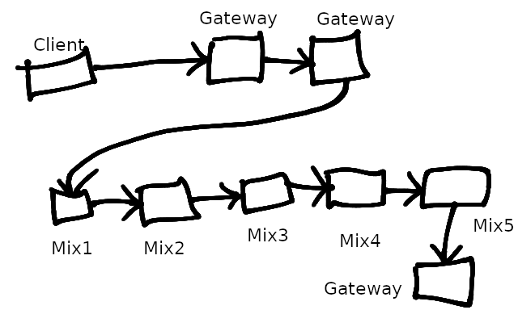

# The xx network message pickup design

Ben Wenger  
Rick Carback  
David Stainton  

*version 0*

## Abstract

Here we discuss some design details of the message transport and pickup.

## Introduction

As was explained in the [architectural overview](architecture.md),
the XX Network is meant to be a general purpose mix network
that can support a wide variety of applications. The clients connect
directly to the gateways for all their network interactions.

The full end to end path looks like this:



Clients interact with a random Gateway in the network which in turn
proxies outbound messages to the correct Gateway associated with
the destination mix cascade. Currently mix cascades have five mix nodes
and five Gateways, each mix node has a Gateway associated with it.
The last mix node sends the mix cascade output messages to it's Gateway
which in turn sends the messages to the rest of the mix cascade's Gateways
for storage.

Messages are queued for up to three weeks in the gateway persistent
message storage. Later on, the recipient client can retrieve their
messages by interacting with any of the gateways.

Clients send their ephemeral recipient ID to the Gateway which responds with:

* known rounds
* bloom filter

Each gateway stores a KnownRounds buffer indicating for each round if
they store messages for that round or not. The bloom filter is
specific to the ephemeral recipient ID and indicates from which rounds
the given ephemeral recipient ID received messages.

The client knows what rounds it has checked in the past. It finds the
set exclusion between that list and known rounds. It then looks up
all members of that exclusion in the bloom filter - which returns true
if messages were received, false if they were not. If a message was
received, the client gets the gateways associated with the round
either from ram, or it isn't present asks any gateway. It then
randomly chooses a gateway in the round and asks it for any messages
received on the ephemeral recipient ID in that round which are
returned to it.

The address space for ephemeral recipient IDs is intentionally small
so as to create collisions such that multiple client would be making
use of the same ephemeral recipient ID.

The client then analyzes the received messages and compares message
IDs with deterministically generated message IDs so as to avoid trail
decryption.

### Pseudo Code Cryptographic Function Glossary

* |: byte concatenation

* H(x): H is a cryptographic hash function. Usually in our
  implementation this is Blake2b.

* Sign(private_key, payload): Returns a cryptographic signature.

* Verify(public_key, data, signature): Returns a boolean which will be
  true if the `signature` is a signature of `data` and is valid for the
  given public key.

## The xx network Gateway wire protocol

* elixxir:comms/messages/messages.proto: Defines all of services and structures
  for the permissioning (registration), server, gateway, and clients in the cMix
  protocol.

The gateway service has the following gRPC service methods:


```
service Gateway {

    // RequestClientKey returns a Nonce to the user
    rpc RequestClientKey (SignedClientKeyRequest) returns (SignedKeyResponse) {
    }

    // PutMessage on the cMix Gateway
    rpc PutMessage (GatewaySlot) returns (GatewaySlotResponse) {
    }

    // PutMessage on the cMix Gateway
    rpc PutManyMessages (GatewaySlots) returns (GatewaySlotResponse) {
    }


    // Client -> Gateway unified polling
    rpc Poll (GatewayPoll) returns (stream StreamChunk) {
    }

    // Client -> Gateway historical round request
    rpc RequestHistoricalRounds(HistoricalRounds) returns (HistoricalRoundsResponse) {
    }

    // Client -> Gateway message request
    rpc RequestMessages(GetMessages) returns (GetMessagesResponse) {
    }

}
```

### Sending messages

`PutMessage` or `PutManyMessages` are used by clients to send messages. The return
values for these two methods indicates whether or not the messages were accepted
into message slots of the specified rounds. For example if all message slots are filled
then the return value indicates the message was not accepted and the client must resend
to a different round.

### Receiving messages

A bloom filter is returned as part of the stream and is used by the
client to determine if an ephemeral message ID has a message delivered or
not. The client may call `RequestMessages` with a set of message IDs
that have been initially confirmed with the bloom filter.

## Message ID Collisions

The message ID space is tuned intentionally to increase the
probability of message ID collisions between clients. These collisions
help protect against intersection attacks. Clients will retrieve
multiple messages and in that sense each message ID represents a
bucket of messages destined for multiple clients.

Clients check the hash at the end of the message, the identity
fingerprint. If it matches their own identity fingerprint then the
message can be processed with the cryptographic protocol described
in our [end to end protocol design document](end_to_end.md).

## Network Identities

Network Identities in the XX network are composed of a 256 bit value
and 8 bit type. The types are as follows:

* 0x00 Generic: Components which do not fit with other
  classifications. Example: Permissioning Server.

* 0x01 Mix Node: Mix nodes composing the network.

* 0x02 Gateway: Gateways within the network. Will always have the same
  value as its associated node.

* 0x03 Client: A client of the network.

Identity values are computed by hashing the sender's RSA public key
and a random 32 byte salt value:
```
value = H(rsa_public_key | salt)
```

We then combine the ID value with the ID type for our sending client ID, for example:
```
sender_id = value | 0x03
```

### Ephemeral Receiver Identities

Ephemeral Recipient IDs in the network will be generated from a
Recipient ID. When a user joins the network they will register two
identities, a Transmission ID and a Recipient ID. They will only
communicate with nodes via their Transmission IDs and will identify
themselves to users in the network via their Recipient IDs. From a
recipient ID, an Ephemeral recipient ID will be generated through the
use of network identity size s, rotating at a set period p, with a
phase offset o.

A recipient ID will be calculated as:

```
ephemeral_recipient_id = H(H(recipient_id) | rotation_salt)[0:s]
```

The phase offset o will be:

```
o = H(recipient_id) % num_offsets
```

Where num offsets is a predefined network constant describing the
number of different change points. A recommended value for a p of 1
day is 2^16.

The rotation salt will be dependent on the current timestamp: The
phase of the timestamp will be computed at:

```
timestamp_phase = timestamp % p
```

If the Timestamp Phase is less than phase offset o, then the rotation
salt used will be:

```
rotation_salt = floor((timestamp - p) / p)
```

otherwise

```
rotation_salt = floor(timestamp / p)
```

Will be used.

A double hash of the RecipientID is used so the intermediary hash can
be provided to third parties to track when you collide without
providing them the information needed to evaluate Identity
Fingerprints (see below). This can support notification systems with
comparatively weak privacy properties.

### Ephemeral ID Structure

The maximum size that Ephemeral IDs can grow to is 2^64, giving support
for up to 2^64-1 simultaneous users. Within messages, the entire 64 bit
space will be used in the message structure, with the unused bits
being filled with random data. When gossiped or stored, the unused
bits will all be 0.

## Message Identification

The cryptographic primitives we are using for encryption/decryption in our
[end to end mixnet protocol](end_to_end.md)
are computationally intensive and slow. Therefore it's important that
our designs avoid trial decryption. Each cMix message has a message
fingerprint field. The fingerprint field is used in one of two ways to
find the proper decryption key.

## Match by Message Fingerprint

Clients store a mapping from fingerprints to keys so that later they can
look up a key based on it's mapped association with a given message fingerprint.

Per message fingerprints are derived from three inputs:

1. session basekey
2. key ID
3. relationship fingerprint

The second half of the basekey is hashed along with the key ID and
the relationship fingerprint to derive the per message fingerprint:

```
data = basekey
data = data[len(data) / 2:]
message_fingerprint = H(data | key_id | relationship_fingerprint)
```

If no fingerprint mapping was found then Trial Hashing Service Identities
are checked for a match, described below.

## Match by Trial Hashing Service Identities

Due to the extra overhead of trial hashing, services are processed
after fingerprints. If a fingerprint match occurs on the message,
services will not be handled.

Service Identification Hash are predefined hash based tags appended
to all cMix messages which, through trial hashing, are used to
determine if a message applies to this client.

```
func ForMe(contents, hash []byte, s Service) bool {
	return H(H(s.Identifier | s.Tag) | contents) == hash
}
```

## Mixing Rounds

Mixing rounds are identified by a sequential monotonically increasing integer
known as the round ID. Here are the round states:

* PENDING: not started yet
* PRECOMPUTING: In the process of preparing to process messages
* STANDBY - Completed precomputing but not yet scheduled to run
* QUEUED - Scheduled to run at a set time
* REALTIME - Running, actively handing messages
* COMPLETED - Successfully deleted messages
* FAILED - Failed to deliver messages

Clients send the latest Round ID they known about and receive a reply with new Round IDs.


## Gateway Message Queueing Behavior

The last mix in the cascade sends the received messages to it's own Gateway.
Then it sends the messages to the 4 other mixes in the cascade who in turn
send the messages to their own Gateways.

Messages are queued for 21 days. As per the [hardware requirements for Gateways](https://xxnetwork.wiki/Hardware_Requirements)
Gateways have 500 GB of storage space.
Gateways retain bloom filters for 30 minutes.
